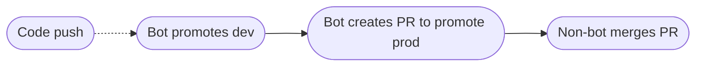

# Promote deployment manifests using PRs and github workflows

A simple way to update deployment manifests using PRs and github workflows.
Whenever a commit is pushed to main, a PR is created that updates the image tag
for the dev deployment. This PR is merged as soon as all required PR checks have
passed. A second PR is then created to do the same update to prod, but is not
merged.

Creating a PR for the dev environment is necessary if pushing directly to the
default branch is prohibited.

[kustomize](https://kustomize.io/) is used to update the deployment manifests.
Other than that, no dependencies or external github actions are needed. See the
[workflow](./.github/workflows/cd.yaml) for all details.

