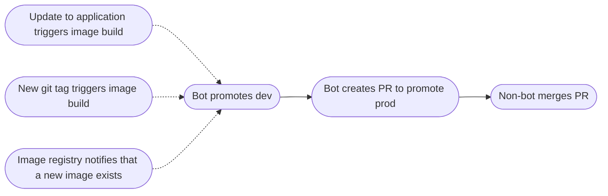

# Promote an image tag with PR:s

Different ideas for how to update the image tags on different deployments.
Assume that we have two environments: dev and prod. Goal: The image is updated
automatically in the gitops repository for dev when a new image is available. A
PR is created to make the same change to the gitops repo for prod.

## Examples of stuff that can trigger the promotion

- The pipeline that pushes the image, e.g. on every commit or when a git tag is
  pushed
- Webhook from image registry when a new image is published

